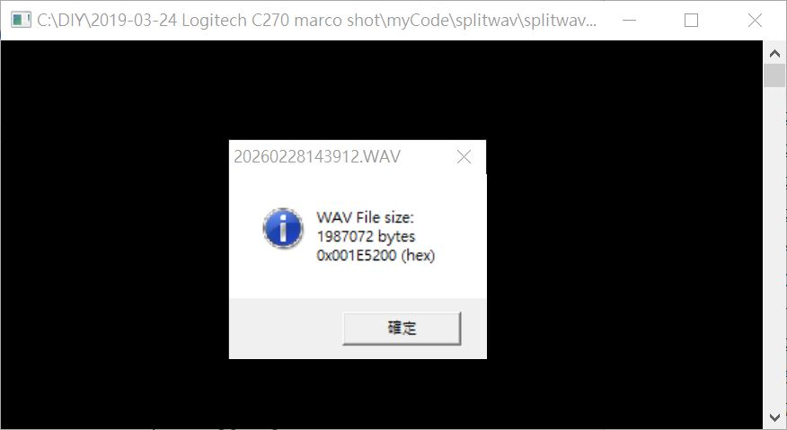

# WAV_file_spliter

  


WAV file, trim size down, simple trick to extract/split first 512KB, dirty but works, perhaps some audio player may complains the wav header mismatch of file size.  

A quick clone and easy solution adaptoed, look at https://github.com/xiaolaba/Acer_Z3-605_ROM_image_spliter.


### file & WAV audio files for demo   
20260228143912.WAV, original WAV
20260228143912_copy.WAV, a full copy of original   
20260228143912_splitted_512K.wav, extracted first 512kB of original  
splitwav.ASM, source code, FASM is used to build exe  
splitwav.EXE, built from asm code, windows OS, to process WAV files  

### source code is self explanatory.   
```


; Split a WAV file to be sections
; by xiaolaba, 2026-FEB-28

; assembler : fasm 1.73.35
; https://flatassembler.net/download.php

; REF:
; https://board.flatassembler.net/topic.php?t=5900
; http://www.betamaster.us/blog/?p=439

format pe console 4.0
include 'WIN32AX.INC'

; data
  FileIn   db '20260228143912.WAV',0
  FileOut  db '20260228143912_copy.WAV',0
  WAV      db '20260228143912_splitted_512K.wav',0
  nWAVESIZE  dd 0
  size512k equ 0x7ffff  ;512k to be save to trimmed wav file, change this in case wanna other file size
                                                                                                          
```
